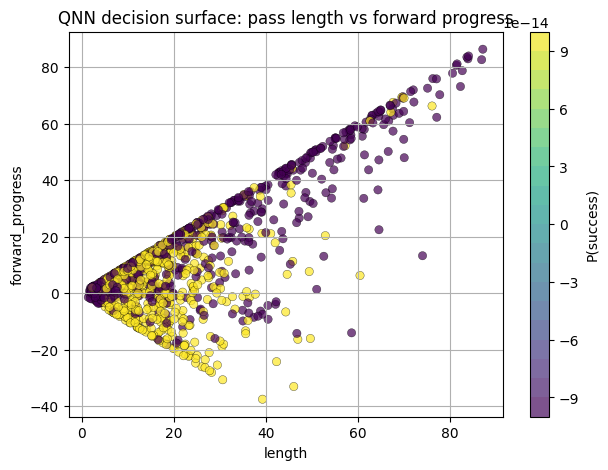
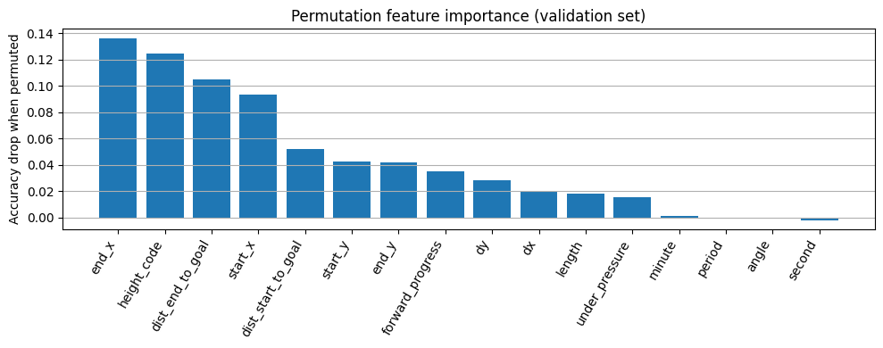

# Quantum Neural Network for Football Pass Success Prediction ⚽⚛️

This project applies **Quantum Machine Learning (QML)** to a real-world
**football analytics problem**: predicting whether a pass will be successfully
completed.

Using **StatsBomb event data** and a **Quantum Neural Network (QNN)** built with
**PennyLane + PyTorch**, the model learns complex geometric and contextual
patterns in football passes and outputs the **probability of pass success**.

The notebook combines:
- large-scale sports data processing
- feature engineering grounded in football tactics
- a variational quantum circuit with data re-uploading
- modern ML training, evaluation, and interpretability tools

## 🔍 QNN Decision Surface

---

## 🚀 Project Overview

**Goal:**  
Predict pass completion (success vs failure) from raw event data using a
**Quantum Neural Network**.

**Dataset:**  
- StatsBomb open football event data (JSON format)
- Up to **200,000 pass events**, safely sampled and processed

**Task:**  
Binary classification  
- `1` → pass completed  
- `0` → pass failed  

---

## 🧠 Model Architecture

### 🔹 Quantum Neural Network (QNN)
- **4 qubits**
- **4 data re-uploading layers**
- Trainable rotations: `RX`, `RY`, `RZ`
- Ring entanglement with `CNOT` gates
- Measurement: ⟨Z⟩ on wire 0
- Differentiation via **adjoint method**

### 🔹 Hybrid Design
- Classical **linear feature map** → quantum angles
- Quantum circuit embedded inside a **PyTorch nn.Module**
- End-to-end training with **Adam optimizer**

---

## 📊 Feature Engineering

Each pass is represented by **16 numeric features**, including:

### Geometry
- start & end coordinates
- pass length & angle
- forward progress
- distance to goal (start & end)

### Context
- pass height (ground / low / high)
- under pressure flag
- match minute, second, and period

Feature scaling is done **after train/val/test split** to avoid leakage.

---

## 📈 Training & Evaluation

- Balanced dataset (50% success / 50% failure)
- Train / validation / test split
- Loss: `BCEWithLogitsLoss`
- Best model selected by **validation accuracy**
- Final evaluation on a held-out test set

Training and validation loss curves are plotted to monitor convergence.

---

## 🔍 Model Interpretability

### ✅ QNN Decision Surface
A 2D visualization of the learned quantum decision boundary over:
- **pass length**
- **forward progress**

This shows how the QNN separates successful vs failed passes in feature space.

### ✅ Permutation Feature Importance
Validation-accuracy drop is measured when each feature is permuted.

Key influential features include:
- end position
- pass height
- distance to goal
- forward progress

---

## 🎮 Interactive Demo (Gradio)

The project includes a **Gradio web interface** where users can:
- adjust pass parameters
- simulate real football passes
- get a **QNN-based probability of success**

This turns the trained quantum model into an interactive tool.

---

## 🛠️ Technologies Used

- **PennyLane** (quantum circuits, lightning backend)
- **PyTorch** (training & optimization)
- **NumPy / Pandas** (data processing)
- **Scikit-learn** (scaling, splits)
- **Matplotlib** (visualization)
- **Gradio** (interactive UI)

---

## 📂 Repository Structure
├── leo-football1.ipynb
├── figures/
│ ├── qnn_decision_surface.png
│ ├── permutation_feature_importance.png
│ └── training_curves.png
├── README.md
└── requirements.txt

---

## 🔗 Kaggle Notebook (with outputs)

The fully executed notebook (including plots and interactive output) is available on Kaggle:

👉 https://www.kaggle.com/code/leoashi/leo-football1

---

## 🎯 Key Takeaways

- Demonstrates **real-world Quantum Machine Learning**
- Combines **sports analytics + QML**
- Uses advanced techniques: data re-uploading, adjoint gradients, interpretability
- Goes beyond toy datasets into **large-scale, noisy, real data**

---

## 📬 Contact

Feel free to open issues or reach out if you’d like to discuss:
- Quantum ML
- Sports analytics
- Hybrid quantum–classical models

